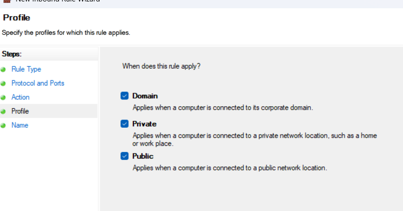
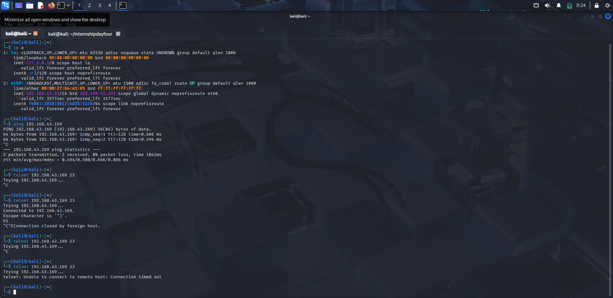

# Setup and Use a Firewall on Windows/Linux
---
##  Objective: Configure and test basic firewall rules to allow or block traffic.

##  Tools: 
-  Windows Firewall / UFW (Uncomplicated Firewall) on Linux.
-  kali linux

## 👣 step i do for set up firewall to block telnet inbound

This guide explains how to block inbound Telnet connections on port 23 using Windows Firewall with Advanced Security.

---

## Steps to Block Telnet Port 23

### 1. Open Windows Firewall with Advanced Security
- Press `Win + R`, type `wf.msc`, and press **Enter** -
- Opens the Windows Defender Firewall with Advanced Security console.
- 

### 2. Create a New Inbound Rule
- In the left pane, click **Inbound Rules**  
- In the right pane, click **New Rule...**
- 

### 3. Select Rule Type
- Select **Port** and click **Next**

### 4. Specify Ports
- Select **TCP**  
- Choose **Specific local ports:** and enter `23`
- 
- Click **Next**
- 

### 5. Choose Action
- Select **Block the connection**
-   
- Click **Next**

### 6. Choose Profile
- Check all: **Domain**, **Private**, **Public**
-   
- Click **Next**

### 7. Name the Rule
- Enter a name, e.g., `Block Telnet Port 23`  
- Click **Finish**

---
## note this 
- start a listener in windows  `ncat.exe -l -p 23 -v`
- 

## Testing the Rule

- From another machine (e.g., Kali Linux), run: `telnet <target-ip> 23`
- successfull blocked
- 

